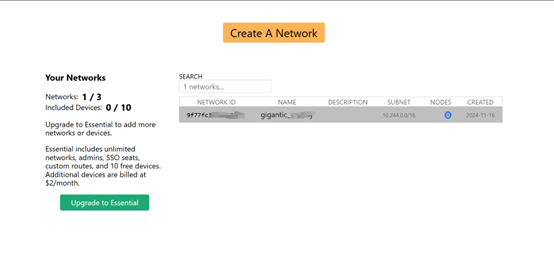
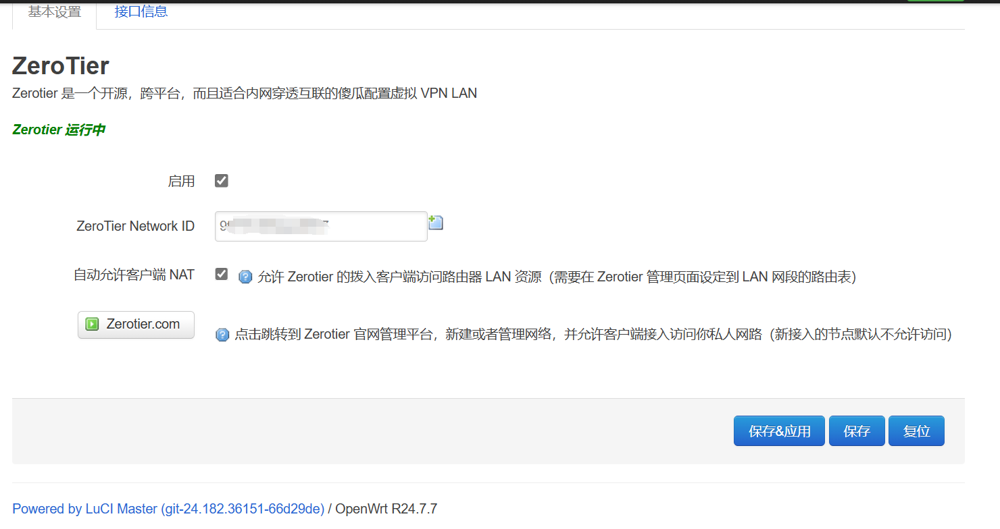
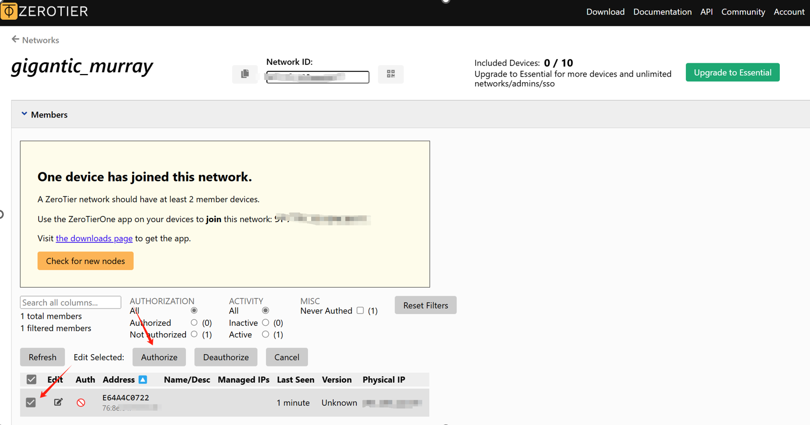
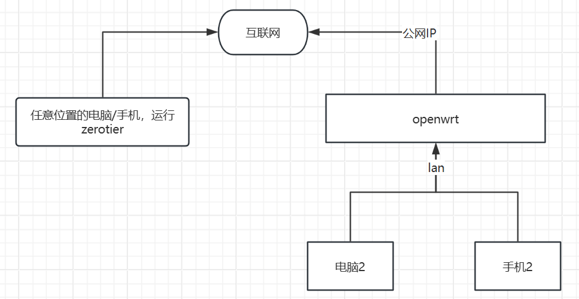
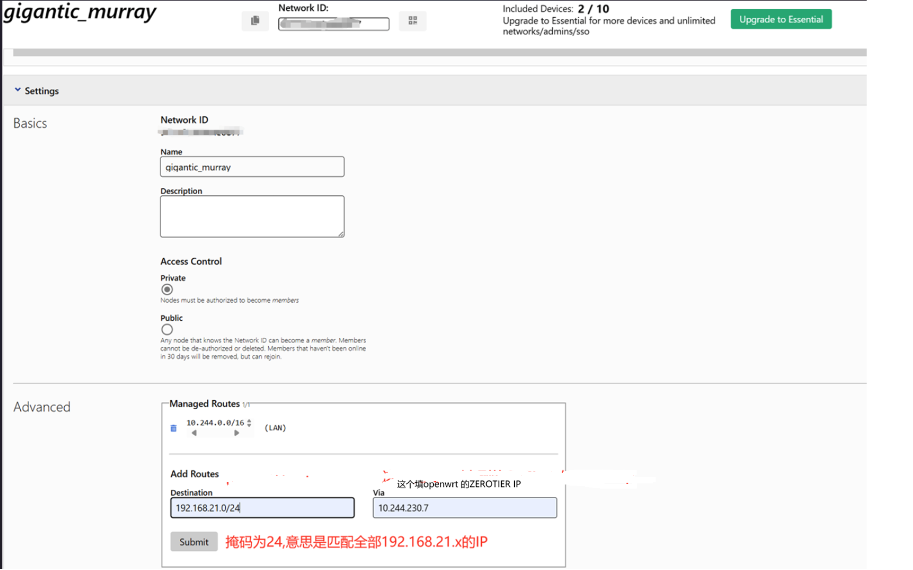
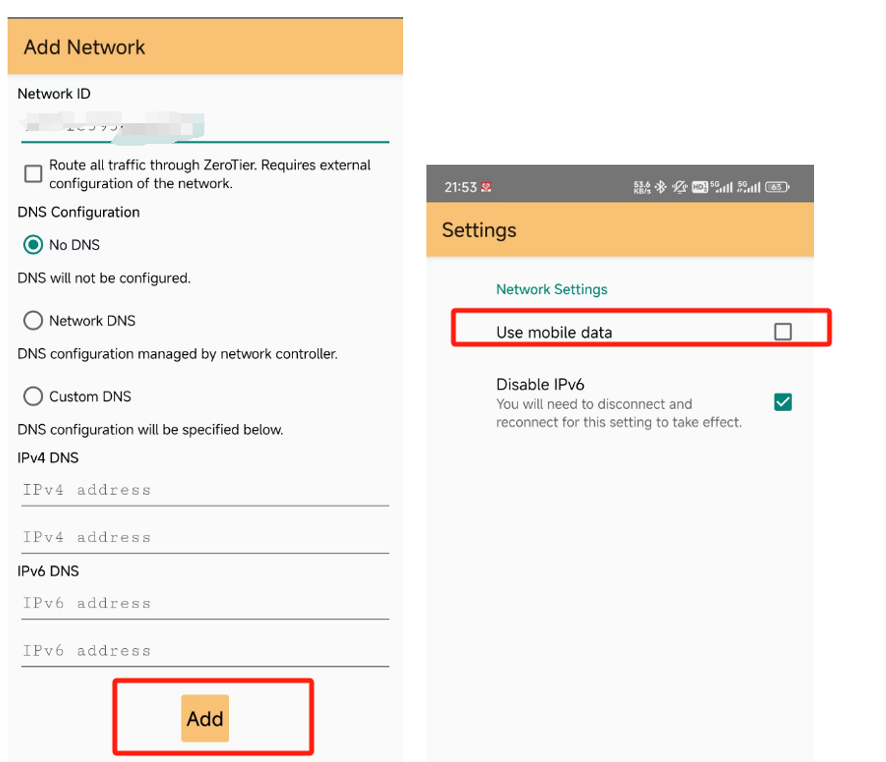

### ZeroTier + OpenWrt使用指南
##### 注意：因为中国路由器大多处于多级NAT下，使用的效果因环境而异

1.	注册zerotier：www.zerotier.com
2.	创建Network id,点击新建的network id, 进入管理界面等待

4.	进入OpenWrt页面，输入network id,点击保存

5.	打开管理界面，对新连上的openwrt设备 打勾并点击

6.	可以看到openwrt里面接口信息才会拿到IP,这个时候已经连上了zero网络，另一台手机或者电脑使用zerotier app 也输入这个network id,就可以访问路由器。

7.	如果要实现这个拓扑，任意位置的电脑要访问手机2和电脑2，需要在zerotier管理页面操作
 

设置为，将到OPENWRT 192.168.21.x网段的设备通过OPENWRT的zerotier转发
OPENWRT的zerotier ip在这里查看， ip地址为10.244.230.7
 
或者在OPENWRT 页面的端口信息也可以看

然后在这个地方添加路由规则，目的是任意地方的手机/电脑 要访问 OPENWRT下面的的设备要通过OPENWRT的zerotier ip

所以 规则如下填，
 

点击submit即可访问openwrt下的设备。

8.	举例手机使用流量上网 访问OPENWRT下的设备：
现在设置运行使用移动网络，输入network id 点击add

然后在管理页面同意手机加入网络,这时，点击状态可以看到已经拿到IP,PING OPENWRT下面的电脑，结果如下
 
